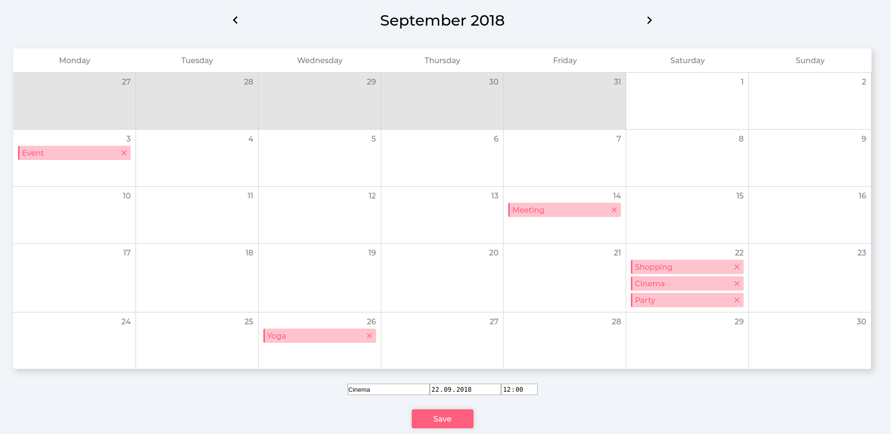

## React/Redux Task - Calender with Reminders

### Core functionality

-   [x] Ability to add a new “reminder”.
-   [x] Display reminders on the calendar view in the correct time order.
-   [ ] Allow the user to select a colour when creating a reminder and display it appropriately.
-   [x] Properly handle overflow when multiple reminders appear on the same date.
-   [ ] Ability to edit reminders – including changing text, day and time & colour.
-   [x] Ability to delete reminders.
-   [x] Expand the calendar to support more than current month.

## Final UI

